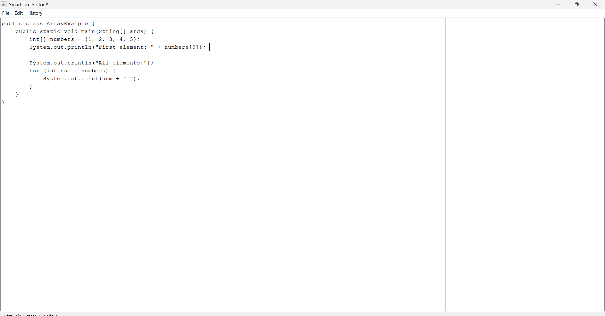
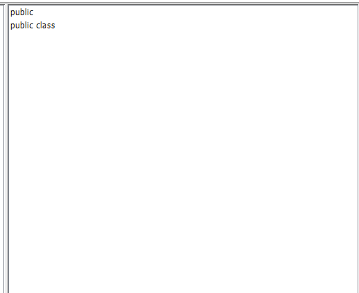
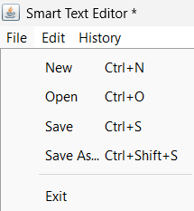
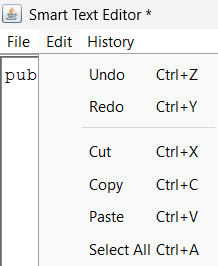
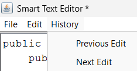

# 📄 Smart Text Editor

A Java-based desktop text editor that showcases the power of Data Structures and Algorithms (DSA) — featuring undo/redo, auto-suggestions, edit history navigation, and file operations, all crafted with pure Java. This project is perfect for learners who want to apply DSA concepts in a real-world application.

---

## ✨ Features

🚀 Smart Text Editing

* Clean, intuitive Java Swing interface.
* Supports .txt and .java files.

♻ Undo & Redo with Stack

* Navigate through edit history seamlessly using classic stack operations.

💡 Auto-Suggestions with Trie

* Dynamic, real-time word completions for Java keywords, classes, methods, and more.

🕹 Edit History Navigation with Linked List

* Step backward and forward through your editing journey using a custom doubly linked list.

💾 Robust File Handling

* Open, save, and create files easily using built-in Java File I/O.

⚡ Keyboard Shortcuts

* Boost productivity with shortcuts like Ctrl+S (Save), Ctrl+Z (Undo), Ctrl+Y (Redo), Ctrl+A (Select All).

🎨 Modern Look & Feel

* Uses system's native appearance for a polished, professional interface.

---

## 🏗 Technologies & Data Structures

* Language: Java SE
* GUI: Java Swing
* Data Structures:

  * Stack → Undo/Redo
  * Trie → Auto-suggestions
  * Doubly Linked List → Edit history tracking
* File Operations: Java File I/O APIs

---

## 🔍 What Makes It Stand Out?

✅ Pure DSA Approach: No external libraries, no fancy frameworks — just core Java and well-crafted data structures.

✅ Educational Focus: Ideal for students or developers learning how to apply stacks, tries, and linked lists in real applications.

✅ Extendable Base: You can easily enhance it with syntax highlighting, spell check, multi-tab support, or export options.

✅ Cross-Platform: Runs anywhere Java runs.

---

## 📥 Getting Started

1. Clone this repository:

   bash
   git clone https://github.com/your-username/smart-text-editor.git
   

2. Open the project in your favorite Java IDE (IntelliJ, Eclipse, NetBeans).

3. Compile and run SmartTextEditor.java.

4. Start editing!

---

## 📸 Screenshots

The main interface of the Smart Text Editor is designed for simplicity and productivity, particularly for programming tasks.

🧾 1. Code Editor Panel (Left Side)
   --
* Primary workspace for writing and editing code.

* Supports syntax highlighting (as seen with keywords like public, class, etc.).

* Handles indentation and formatting for better readability.

* Compatible with Java (as shown), and possibly extendable for other languages.

2. Code Outline Panel (Right Side)
   --
* Displays a structural overview of the code.

* Helps in quickly navigating through the program by listing declarations like:
  Classes,Methods,Access modifiers,

* Automatically updates as the code changes.

📋 Menu Bar – Smart Text Editor
---
Located at the top of the editor window, the menu bar provides access to key features through three dropdown menus:

1. File Menu
   --
 Likely options include:

* New: Creates a new, blank document.

* Open: Opens an existing file from the system.

* Save / Save As: Saves the current file.

* Close: Closes the current document tab or the entire editor.

* Exit: Closes the application.

🧠 Typical use: File management operations.

2. Edit Menu
   --
Contains:

* Undo: Reverts the last change (confirmed by status bar showing Undo: 3).

* Redo: Re-applies an undone change.

* Cut: Removes selected text and copies it to the clipboard.

* Copy: Copies selected text.

* Paste: Pastes content from the clipboard.

* Select All: Highlights the entire content.

🧠 Typical use: Text manipulation and navigation.

3. History Menu
   --
 This menu is less common and is a nice feature for an editor:

* View Edit History: Shows a timeline or list of edits made to the document.

* Revert to Previous Version: Possibly allows rolling back to earlier versions.

* Compare Versions: May allow visual diff between two versions of the document.

  

---

## 🌱 Future Enhancements

* 🔍 Spell check integration
* 🎨 Syntax highlighting for programming languages
* 🗂 Multi-tabbed editing
* 📤 Export to PDF or HTML
* 🔄 Search & replace functionality
* 🌐 Cloud save or collaboration features

---

## 🛡 License

This project is released under the MIT License — feel free to use, modify, and share it.

---

## 🚀 GitHub Badges

---
